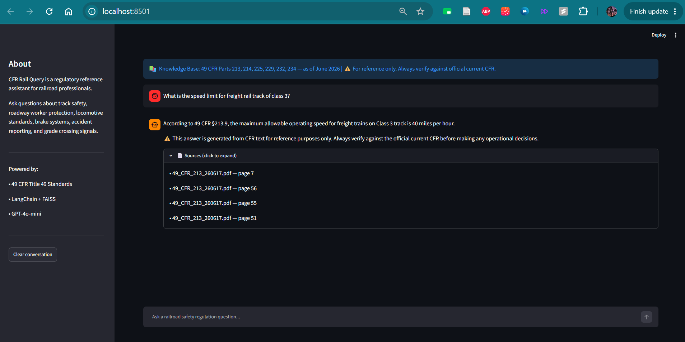

# cfr-rail-query

> AI-powered regulatory reference assistant for railroad professionals. Query 49 CFR federal railroad safety standards using natural language and get grounded, citation-backed answers.

---

## Demo



---

## How It Was Built — Engineering Decisions

This section documents the real decisions made during development, including problems found and how they were resolved.

### 1. PDF Extraction — PyPDFLoader → pdfplumber
Started with LangChain's default PyPDFLoader. Discovered Part 214's multi-page protection distance table was extracting as repeated header boilerplate — column content interleaved, footnotes missing. Switched to pdfplumber which reads tables as structured cell groups. Fixed completely.
Lesson: default loaders are not always appropriate for structured regulatory documents.

### 2. Chunking — Hybrid RecursiveCharacterTextSplitter
CFR paragraphs are labeled (a), (b), (c) and are self-contained legal units. Naive character split at 500 chars cuts mid-sentence through legal conditions and consequences.

Used RecursiveCharacterTextSplitter with:
- separators=["\n\n", "\n", " ", ""]
- chunk_size=1000
- chunk_overlap=100

Tries paragraph breaks first, only cuts further if a paragraph exceeds 1000 characters. Result: 1555 chunks, min 108 chars, max 1000 chars, avg 839 chars — zero suspiciously short or long chunks.

### 3. Metadata Enrichment — Section-Aware Chunks
eCFR PDFs include an auto-generated footer on most pages:
"49 CFR 232.714(b) (enhanced display) page 67 of 70"

This is eCFR's own ground-truth section pointer. Extracted cfr_part, cfr_part_title, and section from this footer at page level before splitting — LangChain propagates metadata to every child chunk automatically. Zero extra API cost.

Gap found: section metadata records only the trailing endpoint of each page. Pages spanning multiple subsections only record the final one. Mitigated by prefix matching in cross-reference resolution (e.g. match "232.205" not "232.205(c)(1)(ii)").

### 4. Model Upgrade — GPT-3.5-turbo → GPT-4o-mini
Confirmed cross-chunk fusion hallucination with GPT-3.5-turbo: took a real PPE rule from §214.115 and a real distance figure from §214.336(f) and synthesized "wear foot protection within 25 feet" — a claim that exists in neither source.

Adding prompt Rule 4b did not fix it. GPT-3.5 cannot hold multiple citation rules simultaneously under retrieval pressure. This is a model capability ceiling, not a prompt problem.

Upgraded to GPT-4o-mini — correctly separates unrelated facts with individual citations.
Lesson: some hallucination patterns cannot be solved by prompt engineering alone. Model upgrade is the right lever.

### 5. Two-Stage Retrieval — Cross-Reference Following
CFR documents are heavily self-referential:
"Class I brake test as described in paragraph (c) of this section."

Flat retrieval fetches the pointer but not what it points to — LLM fills the gap from training knowledge, producing confident wrong answers.

Built two-stage pipeline:
- Stage 1: FAISS semantic search, k=6
- Stage 2: scan retrieved chunks for §XXX.XXX patterns AND implicit "paragraph (x) of this section" references, fetch matching chunks by metadata prefix lookup, inject up to 4 chunks per hop, max 2 hops

Two hops: CFR cross-reference chains rarely exceed 2 levels. Visited set prevents circular references. MAX_REFERENCE_HOPS and MAX_INJECTED_CHUNKS are configurable constants.

### 6. Table Handling — Prose/Table Split
Corpus-wide audit: 63 tables across 50 pages. LLM misreads borderless regulatory tables — §213.233(c) inspection frequency matrix collapsed into a false binary instead of its actual three-dimensional structure (track type × traffic type × frequency).

Design decision: do not summarize tables. Instead route them as direct source references:
- Detect bordered tables at chunk level using pdfplumber lines/lines strategy (zero false positives confirmed on 416 pages)
- Tag chunks: contains_table=True/False
- Split retrieved chunks: prose_chunks → LLM, table_chunks → UI reference cards only
- Rule 7 directs LLM to send users to source document for table values
- UI shows "📊 Regulatory Tables Referenced" cards with exact section and page number

Known gap: borderless tables (§213.233(c), §213.113(c)) produce content-poor chunks that do not win semantic search — Rule 7 does not fire for these cases in practice.
Production fix: GPT-4o vision extraction (~$3-4 one-time cost for full corpus).
Documented as known limitation — cost vs scope trade-off.

### 7. contains_table — Chunk-Level Override
Initial implementation set contains_table at page level — inherited by all chunks from that page. Result: 217 of 1555 chunks flagged but only 50 pages had tables. 167 prose chunks incorrectly withheld from LLM.

Fix: after splitting, override contains_table by checking chunk content directly for markdown table separator rows ("|---|"). Dropped from 217 → 54 flagged chunks.
Lesson: page-level metadata does not always make sense at chunk level.

### 8. Conversational Memory — 5-Exchange Rolling Window
Without memory, follow-up questions like "what about Class 4?" fail — FAISS receives a vague fragment with no retrievable signal.

Two-step solution:
1. Store last 5 Q&A exchanges in Streamlit session state — rolling window, oldest drops off at exchange 6
2. Before retrieval, rewrite follow-up as standalone question using GPT-4o-mini:
   - Preserves regulatory topic from history
   - Replaces pronouns with actual subjects
   - Does not introduce new topics

Rewriting before retrieval is the key insight — the rewritten question goes to FAISS, not the vague follow-up. Better semantic search, better chunks, better answers.

### 9. Prompt Engineering — 7 Behavioral Rules
Built incrementally as failures were discovered:

| Rule | Added When |
|---|---|
| 1. No outside knowledge | Day 1 — foundational |
| 2. Mandatory citation | Day 1 — foundational |
| 3. Flag partial answers | Day 1 — foundational |
| 4. No interpretation | Day 1 — foundational |
| 4b. No cross-section fusion | After GPT-4o-mini upgrade |
| 4c. No cross-paragraph fusion | After Q2 paragraph fusion found |
| 5. Out of scope rejection | Day 1 — foundational |
| 6. Disclaimer on every answer | Day 1 — foundational |
| 7. Never approximate table values | After table architecture built |

Rules 4b and 4c were added after specific hallucination patterns were observed and diagnosed during testing — not speculatively.

---

## What It Does

Railroad inspectors, locomotive engineers, and roadway workers can ask natural language questions about federal safety regulations and receive answers grounded strictly in retrieved CFR text — with mandatory source citations and no hallucination from outside knowledge.

Example questions:
- "What are the speed limits for Class 2 freight track?"
- "What PPE is required when working within 25 feet of live track?"
- "When must a locomotive be removed from service for brake defects?"
- "What injuries must be reported to FRA and within what timeframe?"
- "What are the rules for a Class 1 brake test?"

---

## Architecture

```
49 CFR PDFs (6 parts, ~320 pages)
        ↓
pdfplumber extraction + table detection
        ↓
RecursiveCharacterTextSplitter (1000/100)
+ metadata enrichment (cfr_part, section,
  contains_table)
        ↓
OpenAI text-embedding-3-small
        ↓
FAISS vector index (1555 chunks)
        ↓
Two-stage retrieval:
  Stage 1: semantic search (k=6)
  Stage 2: cross-reference following (2 hops)
  + prose/table split
        ↓
Conversational question rewriting (last 5 exchanges)
        ↓
GPT-4o-mini with 7 behavioral rules
        ↓
FastAPI → Streamlit
```

---

## Corpus

| CFR Part | Topic |
|---|---|
| 213 | Track Safety Standards |
| 214 | Roadway Worker Safety |
| 225 | Railroad Accident/Incident Reporting |
| 229 | Locomotive Safety Standards |
| 232 | Brake System Safety Standards |
| 234 | Grade Crossing Signal Systems |

Source: eCFR (ecfr.gov) — as of June 2026

---

## Behavioral Rules

The system enforces 7 hardcoded rules on every answer:

1. Answer only from retrieved CFR text — no outside knowledge
2. Every answer cites CFR Part and Section number
3. Partial answers are flagged explicitly
4. No interpretation beyond the regulatory text
5. Out-of-scope questions are rejected
6. Every answer carries a verification disclaimer
7. Table values are never approximated — user is directed to source document

---

## Key Engineering Decisions

| Decision | Rationale |
|---|---|
| pdfplumber over PyPDFLoader | Cleaner extraction, handles complex tables |
| text-embedding-3-small | Better than ada-002, 6x cheaper than large |
| GPT-4o-mini over GPT-3.5-turbo | GPT-3.5 had confirmed cross-chunk fusion hallucination not fixable via prompt engineering |
| Two-stage retrieval | CFR documents contain internal cross-references (e.g. "as described in paragraph (c) of this section") that flat retrieval misses |
| Prefix metadata matching | Section metadata records page trailing endpoint only — exact matching would miss earlier subsections on multi-section pages |
| Prose/table split | LLM misreads borderless regulatory tables — safer to direct users to source document than risk wrong values |
| Conversational rewriting | Follow-up questions rewritten as standalone before retrieval — better semantic search than passing raw follow-up |
| k=6 retrieval | k=4 caused retrieval gaps on cross-referenced paragraphs |

---

## Known Limitations

- **Borderless tables** (e.g. §213.233(c) inspection frequency, §213.113 defect remedial actions) cannot be reliably extracted by pdfplumber. Rule 7 directs users to the source document for these cases.
  *Production fix: GPT-4o vision layer for image-rendered pages (~$3-4 one-time cost for full corpus)*

- **Section metadata** records the trailing endpoint of each page — pages spanning multiple subsections only record the final one. Mitigated by prefix matching in cross-reference resolution.

- **Corpus is static** — built on June 2026 CFR text. Regulatory amendments after this date are not reflected.

---

## Stack

| Tool | Purpose |
|---|---|
| Python 3.11 | Runtime |
| LangChain | RAG chain orchestration |
| FAISS | Local vector index |
| OpenAI text-embedding-3-small | Embeddings |
| OpenAI GPT-4o-mini | Answer generation |
| pdfplumber | PDF extraction |
| FastAPI | Backend API |
| Streamlit | Frontend UI |
| Docker | Containerisation |

---

## How to Run Locally

**Prerequisites:** Python 3.11, Docker (optional)

**Note:** All commands in steps 5 and 6 run from the `src/` directory. The index build in step 4 runs from the project root.

**1. Clone the repo**
```bash
git clone https://github.com/yourusername/cfr-rail-query
cd cfr-rail-query
```

**2. Add your OpenAI API key**
```bash
cp .env.example .env
# Edit .env and add your OPENAI_API_KEY
```

**3. Add CFR PDFs**
```
Download 49 CFR Parts 213, 214, 225, 229, 232, 234
from ecfr.gov and place in data/raw/ with filenames:
49_CFR_213_[date].pdf
49_CFR_214_[date].pdf
etc.
```

**4. Build the index**
```bash
pip install -r requirements.txt
python src/ingest.py
```

**5. Start the API**
```bash
cd src
uvicorn api:app --port 8000
```

**6. Start the UI** (new terminal, from project root)
```bash
cd src
streamlit run app.py
```

Open http://localhost:8501

---

## API

### POST /query
```json
Request:  {"question": "string",
           "chat_history": [...]}
Response: {"answer": "string",
           "sources": [...],
           "table_references": [...]}
```

### GET /health
```json
{"status": "ok"}
```

---

## Project Structure

```
cfr-rail-query/
  data/raw/          ← CFR PDFs (not committed)
  src/
    ingest.py        ← PDF loading, chunking,
                        FAISS index build
    retriever.py     ← Two-stage retrieval +
                        cross-reference following
    chain.py         ← Prompt + LangChain chain
    api.py           ← FastAPI endpoints
    app.py           ← Streamlit UI
  faiss_index/       ← Saved index (not committed)
  requirements.txt
  .env.example
  CONTEXT.md         ← Full design decisions log
```

---

## Resume Bullets

**General:**
Built an end-to-end RAG pipeline over 49 CFR federal railroad safety standards, implementing two-stage retrieval with cross-reference following, prose/table routing, and conversational memory; deployed via FastAPI and Streamlit with GPT-4o-mini.

**Rail-specific:**
Developed a regulatory reference assistant for railroad safety professionals enabling semantic search across 6 CFR parts with citation-backed, hallucination-controlled answers enforced via 7 hardcoded behavioral rules.

---

*Built with LangChain · FAISS · GPT-4o-mini · FastAPI · Streamlit*
